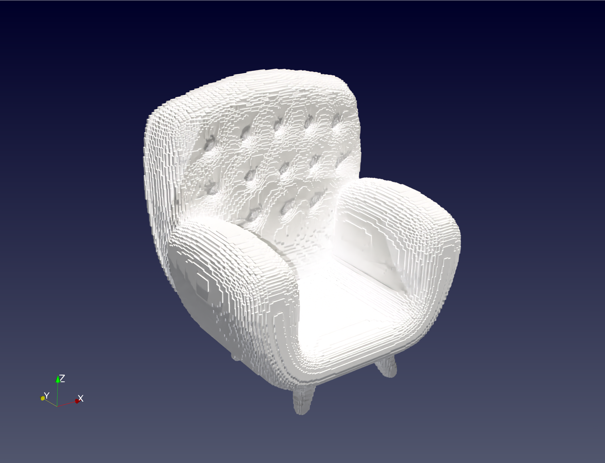

# MyVoxelizer
This is a Simple Voxelizer Program for convert the file type between .stl and .vtk(voxel).
## Prerequisites

* using the CMake to build the project
* using ParaView to visualize the .vtk file

## Getting Started

First, clone the repository and configure the build directory:
```
cmake -B build -DCMAKE_BUILD_TYPE="Release"
cmake --build build
```
Then, you can run the program with the following command:
```
./main <stl file>
```

## Results

The model before voxelization(.stl):

The model after voxelization(.vtk):


## Authors
* Hajer Zhang, IDEAS, DLUT, China
* Email: zbaili966@gmail.com
* Date: 2024.12.18

