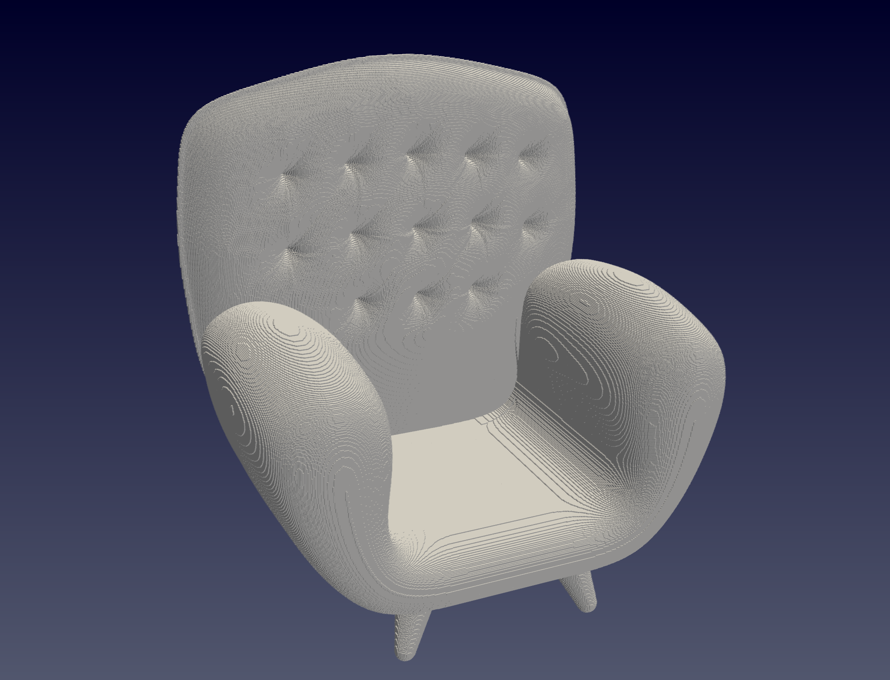

# MyVoxelizer
This is a Simple Voxelizer Program for convert the file type between .stl and .vtk(voxel).
## Prerequisites

* using the CMake to build the project
* using ParaView to visualize the .vtk file

## Getting Started

First, clone the repository and configure the build directory:
```
cmake -B build -DCMAKE_BUILD_TYPE="Release"
cmake --build build
```
Then, you can run the program with the following command:
```
./main ./model/sofa.stl
```

## Results

<div style="display: flex; justify-content: space-between;">
    
    
</div>
<p style="text-align: center;">Figure 1: The original model (left) and the voxelized model (right) of sofa model.</p>


## Authors
* Hajer Zhang, IDEAS, DLUT, China
* Email: zbaili966@gmail.com
* Date: 2024.12.18

## Update
* 2024.12.23：Add a [Viewer](./Viewer.py) based on the VTK, pyvista, pyvistaqt, and PyQt5. But the viewer is not stable now.
<div style="display: flex; justify-content: center; margin: auto; width: 80%;">
    
</div>

* 2024.12.25：Update the new algorithm for voxelization, and the new algorithm is more efficient than the previous one.
<div style="display: flex; justify-content: space-between;">
    
    
</div>

<p style="text-align: center;">Figure 2: Comparison of the algorithm before (left) and after (right) of bunny model.</p>


